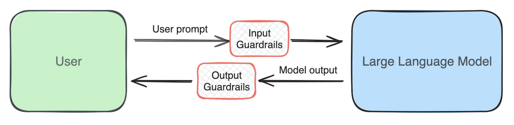
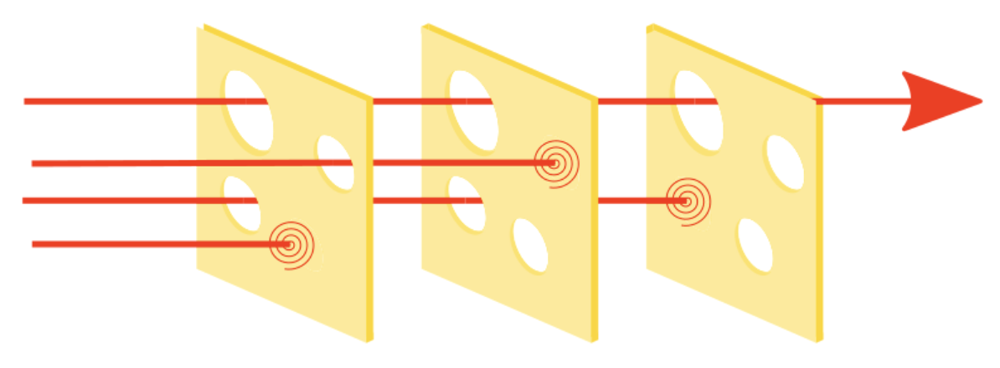

# Guardrails

!!! success "Key Message"

    Guardrails are protective filters that increase the likelihood of your Large Language Model (LLM) application behaving appropriately and as intended. Guardrails should be: (i) performant, localised, and fast; (ii) model-agnostic; and (iii) actionable and configurable.

## What are guardrails? 🛡️ 

Guardrails are protective mechanisms that increase the likelihood of your Large Language Model (LLM) application behaving appropriately and as intended. For example, you may have a chatbot explaining the different healthcare financing schemes to the public. In this case, you would want to ensure that the chatbot does not generate harmful nor inappropriate content such as medical advice.

At GovTech, we use the term guardrails to refer specifically to _separate components_ from the LLM itself that can filter or even adjust harmful or undesired content before it is generated by the LLM or returned to the user. The diagram below best illustrates how guardrails work in an AI system. As shown, prompts are first passed through an **input guardrail** before being sent to the LLM. Correspondingly, the output from the LLM is then passed through an **output guardrail** before being returned to the user. While it is true that LLMs do have some built-in safety mechanisms baked in through their training process or that API providers may have their own guardrails when they process the prompts we provide, we find it useful to have guardrails that build upon this for both performance and flexibility reasons that we will articulate below.

_Figure 1: High-level overview of guardrails in an AI system_

Guardrails can be as simple as a keyword check. For example, does the input or output contain any keywords defined in a blacklist of terms (e.g., common profanities or disallowed topics)? However, such an approach may not always be effective and does not leverage upon the predictive capabilities of machine learning models. Thus, more modern implementations would likely incorporate some machine learning too, in order to capture the semantics of the statement. Additionally, these guardrails are also multi-layered, ensuring overall robustness.

!!! tip "Tip: Guardrails as a Machine Learning Classification Task"

    For those with a Machine Learning background, guardrails can be thought of as a binary classification task: Is the content acceptable or not? Hence, typical classification metrics such as precision, recall, Receiver Operating Characteristic Area Under the Curve (ROC-AUC), F1-score, etc. can be used to evaluate the performance of the guardrail. More details on these metrics can be found [here](https://scikit-learn.org/stable/auto_examples/model_selection/plot_precision_recall.html).

Here are some common types of risks you might want guardrails for in your AI system:

| Type | Description | Input | Output |
|------|-------------|:-----:|:------:|
| Toxicity/Content Moderation | Harmful, offensive, or inappropriate content | ✓ | ✓ |
| Jailbreak/Prompt Injection | Attempts to bypass system constraints or inject malicious prompts | ✓ | |
| PII | Information that can identify an individual | ✓ | ✓ |
| Off-Topic | Content irrelevant to the application's purpose | ✓ | ✓ |
| System-Prompt Leakage | Exposure of system prompts containing application information | | ✓ |
| Hallucination | Content not factual or grounded in source material | | ✓ |
| Relevance | Responses not pertinent to user queries | | ✓ |

We elaborate more on each of these guardrails in our [next chapter](guardrails/diff_guardrails.md).

## Principles for Effective Guardrails 🎯

In our last year of work on guardrails, we have identified three principles that are crucial for effective guardrails.

### 1. Performant, Localised, and Fast 🚀

Firstly, guardrails should be **performant, localised, and fast** - and each builds upon the previous. Having a performant guardrails means one can correctly identify unwanted content. However, there is an inherent trade-off between false positives and false negatives, or what we call the "precision vs recall" trade-off in machine learning parlance. If the guardrail is too strict, it may wrongly flag more harmless content, while if it is too lenient, it may wrongly flag more harmful content.

Performance arises also from a multi-layered approach. For example, while an individual guardrail may not be able to identify harmful content, a combination of guardrails is likely to do so. This is also known as the "Swiss cheese model", where each guardrail is like a slice of cheese, and the holes in the cheese represent the weaknesses in each guardrail. Each guardrail will complement the others, and together they form a robust system. 

_Figure 2: The Swiss cheese model of guardrails_

!!! tip "Tip: Balancing Between Precision and Recall"

    If your system can accomodate different guardrails, you may want to consider prioritising precision over recall for each individual guardrail. And by stacking different guardrails, you could potentially increase the overall recall of the system.

Performance also typically requires localisation. One obvious example is language and culture - a content moderation guardrail trained based on the internet may not precisely classify the nuances of terms used in Singapore. Beyond that, there is also localisation to the business context. For example, a specific acronym or terminology that is common in one industry may not be used in another. There is thus also a trade-off here between being universal and localised. 

!!! example "Case Study: LionGuard 🦁 - a localised content moderation guardrail"

    LionGuard is a content moderation guardrail that is localised to the Singapore context. You can read more about it [here](https://medium.com/dsaid-govtech/building-lionguard-a-contextualised-moderation-classifier-to-tackle-local-unsafe-content-8f68c8f13179) and try it out [here](https://go.gov.sg/lionguard).

There is then the last trade-off between accuracy and latency. Guardrails should operate efficiently without introducing significant latency, ensuring real-time feedback and a smooth user experience. Being performant also means that the guardrails can accurately identify harmful content.

### 2. Model-Agnostic Design 🧩

As defined above, we treat Guardrails as _separate components_ from the LLM itself. By doing so, we can separate develop and test the different components independently. This also offers us the flexibility to swap out different guardrails and LLMs, depending on the scenario. 

!!! info "Extra: Alignment and Reinforcement Learning from Human Feedback (RLHF)"

    The task of ensuring that models are safe typically falls within the problem space called "Model Alignment". For models that power applications like ChatGPT, Alignment is typically achieved through Reinforcement Learning from Human Feedback (RLHF). We will not delve into the details of RLHF here, but it is a very active area of research and development in the LLM space. See [here](https://openai.com/index/chatgpt/) for more details.

Having the guardrail as a separate component also allows us to **determine the minimum safety performance of our system**. Typical implementations of guardrails tend to be more deterministic compared to the variability of LLM outputs. Hence, if a guardrail has 95% accuracy in detecting not suitable for work (NSFW) language, then the entire system’s safety level is also at least 95%, leaving the model to deal with the remainder. Moreover, the underlying LLM or API provider may also change their own implementations. Hence, having separate guardrails provides us with more certainty on the holistic performance of the system.

### 3. Actionable and configurable 🔧

Being actionable means that the product team can take more differentiated actions based on the guardrail's confidence or severity scores. If there was only a binary response, the application can then only take two possible courses of action. Conversely, if the guardrail provides a 0-1 confidence or severity score, the product team can then take more differentiated actions. For example, if the score was between 0 to 0.33, the application could choose to log the content; if the score was between 0.34 to 0.66, the application could choose to warn the user; and if the score was between 0.67 to 1, the application could choose to block the content.

!!! info "Extra: Confidence and Severity Scores"

    Confidence refers to how certain the guardrail is about its classification. Here we loosely interchange it with the term "probability" too. On the other hand, severity refers to the degree of harmfulness of the content. Guardrail providers typically provide one of the two.

    For confidence, it is important for these scores to be calibrated. A well-calibrated confidence score should have the property that, if the guardrail predicts that there is a 50% chance that the content is harmful, then in fact, 50% of the time, the content is harmful. 

    When we use most machine learning models out of the box, the probability scores are not well-calibrated. See [here](https://scikit-learn.org/1.5/modules/calibration.html) for further details on calibration.

Being configurable means that the product team can adjust the guardrail's parameters to meet the needs of the application. For example, the product team may want to adjust the threshold for the confidence or severity scores. Balancing precision (accurately identifying harmful content) and recall (capturing all instances of harmful content) is crucial; this balance should be adjusted according to the application's context—for example, prioritizing recall in healthcare settings where safety is paramount, or emphasizing precision in customer service to enhance user experience.

!!! note "Original Blog Post"

    This page is adapted from our [original blog post](https://medium.com/dsaid-govtech/building-responsible-ai-why-guardrails-matter-b66e1d635d71) on this topic.