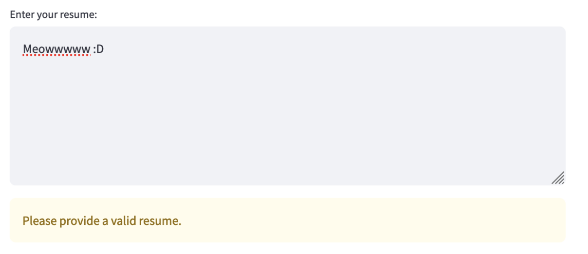
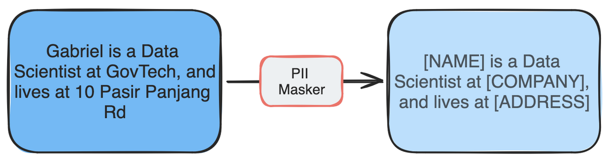

# Best Practices When Integrating Guardrails

## 1. Start simple

Guardrails are needed from Day One, but you don't need complex solutions to get started. Even basic measures like:

- Using structured inputs instead of free-form text
- Simple keyword searches and pattern matching
- Basic input validation

can be effective initial guardrails. You don't need a data scientist to implement these foundational protections.

## 2. Balance User Experience with Protection

Guardrails must strike a balance between blocking harmful content and maintaining a positive user experience. Over-filtering and false positives can frustrate users and erode trust in your system.

Consider the following:
- Use progressive disclosure - start with warnings before blocking
- Provide clear feedback on why content was flagged
- Offer suggestions on how to modify flagged content
- Allow users to override certain low-risk flags with acknowledgement
- Consider context-specific thresholds (e.g. stricter for public-facing content)

For example, if a user's input contains mild profanity, you could show a warning message first rather than immediately blocking.

As another example, suppose the Retrival-Augmented Generation (RAG) application retrieves a chunk that contains PII. You may not want to stop the request, and instead modify the output to remove the PII.

This balanced approach maintains safety while avoiding user frustration from overly aggressive blocking.

## 3. You can have more than 1 guardrail for the same type of risk

Adopt a layered approach by combining multiple guardrails, for example:

- Using both built-in LLM safety features and external moderation APIs
- Combining general and localized content moderation (e.g. OpenAI moderation + LionGuard)
- Having both basic pattern matching and ML-based detection

This provides more comprehensive protection against risks.

## 4. Need speed? Go async

To minimize latency impact when using multiple guardrails:

- Process guardrail checks asynchronously in parallel
- Consider running LLM generation alongside guardrail detection. See [here](https://cookbook.openai.com/examples/how_to_use_guardrails#mitigations) for a potential implementation.
- Use lightweight models where possible (e.g. PromptGuard at 86M parameters)
- Implement caching for frequently checked content

This allows you to maintain protection without significantly impacting response times.
