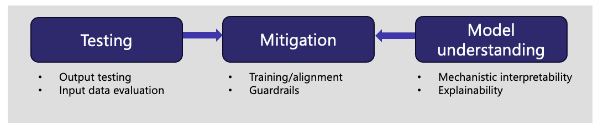

# Responsible AI Playbook

## Overview

Broadly, Responsible AI (“RAI”) focuses on how to develop, evaluate, deploy, and monitor AI systems in a safe, trustworthy, and ethical manner. From how data is collected to how humans interact with AI systems, RAI will help to guide these decisions toward beneficial and equitable outcomes. In the public sector context, RAI will help align AI systems to achieve the public good.

At GovTech's AI Practice, we break down RAI into 6 key principles that AI systems should strive towards. 

| Principle    | Description |
|--------------|-------------|
| Safety       | AI systems should be (i) protected against adversarial threats and misuse for harmful activities and (ii) aligned to the public good. |
| Robustness   | AI systems should perform up to task even when subjected to challenging requirements or circumstances. |
| Fairness     | AI systems should strive to be fair and equitable to all, regardless of gender, race, religion, or other attributes. |
| Explainability | AI systems should provide clear and reliable explanations for their automated decisions to key stakeholders. |
| Privacy      | AI systems should handle personal data carefully and protect against potential data leakages. |
| Transparency | AI systems should document key development and deployment choices and be clear about how the AI system should be used. |

## Objectives

This playbook aims to provide resources, recommendations and technical guides to deploying AI responsibly in your applications. However, the resources reviewed are not meant to be exhaustive. Readers are encouraged to use them as references and apply them at their own discretion.

Various circulars exist to uphold RAI principles in government, such as PMO (SNDGO) Circular No. 1/2023 on the 'Use of Large Language Models in the Public Sector'. This playbook aims to complement these circulars by deep-diving into certain risks and providing greater technical detail to measure and mitigate them. 

There have also been several other playbooks released to guide secure AI adoption in government, such as CSA's Guidelines and Companion Guide for Securing AI Systems. Unlike them, this playbook aims to cover the safety aspects of Responsible AI, and will only briefly touch on security risks.  

## Life Cycle

_Figure: AI life cycle._

AI risks, as well as mitigating measures, exist at each stage of the application life cycle. 

### Data

As the old adage goes, "garbage in, garbage out". If unsafe or biased data is used for training, the model outputs are likely to be unsafe and biased as well. Large Language Models are typically pre-trained on massive amounts of text from the Internet, which contain harmful, toxic and biased texts. This has resulted in models learning such textual distributions and producing similar outputs. As such, a large body of research has been dedicated to improving data quality in pre-training data. 

### Model

In discriminative AI settings, the choice of modelling parameters can greatly impact their fairness. For example, the use of sensitive variables in predictive algorithms can lead to unfair outcomes. 

Most generative modeling approaches entail autoregressively generating the next most probable token, which depends on the joint distribution of tokens learned during training. As such, if unsafe token sequences are learned, they will naturally be reproduced by the model. 

To reduce model harms in LLMs, significant research has been dedicated to aligning models with human preferences and desirable values. Given paired text data and their rankings, LLMs undergo a second stage of reinforcement learning to learn to output preferred (i.e., safer) responses. 

Another significant research direction entails analysing harmfulness and toxicity in LLM neurons and layers. Having found the weights or activations that are most responsible for toxicity, it is then possible to edit the models to reduce the incidence of harmful outputs. This is typically known as a white box approach to tackling model harmfulness. 

### Application

Finally, when an AI model is embedded into a software application, the way users interact with the application may also result in significant risks. For example, users may intentionally probe the application to exfiltrate sensitive data or elicit harmful outputs at scale. As such, input and output guardrails have emerged as viable defences against such risks. Guardrails are typically known as black-box defences as they do not require access to the models and can be easily deployed in the application layer. 

##  Our Approach

_Figure: Functional focus areas for Responsible AI._

At present, our approach to deploying AI model safely involves **testing**, **mitigation** and model **understanding**. 

Testing involves establishing safety categories of interest, as well as their requisite metrics. This is followed by collecting testing data, which can be static or dynamic, general or domain/use case-specific, synthetic or real. The testing data is then used to generate safety metrics, to determine the overall safety of the application. While testing can technically be conducted at any point of the application life cycle, third party testing is typically done at the application level. 

After testing is completed, mitigation measures can then be adopted, where applicable and appropriate. A common mitigation measure is finetuning or alignment, in which AI models are trained to output human-preferred responses, or aligned to human values, requiring access to model weights. On the other hand, mitigations at the application level in the form of guardrails are more general and can be widely applied to different contexts. 

Lastly, model understanding, whether by understanding the internal mechanisms (i.e., mechanistic interpretability) or outputs (i.e., explainability), is important in increasing transparency of and trust in AI. 

In the first version of this playbook, we will focus on testing and mitigations at the application level. At present, this largely entails [output testing](testing.md) and [guardrails](guardrails.md).

## Contributions

We welcome contributions to this playbook as we work together to ensure Responsible AI in government. This playbook is meant to be a living document as we adapt to new insights, real-world challenges, and emerging best practices. Our goal is to create a practical resource that serves the diverse needs of the public sector and remains grounded in the realities of deployment and implementation. 

If you would like to contribute, please raise a pull request and we will review it accordingly. Thank you. 