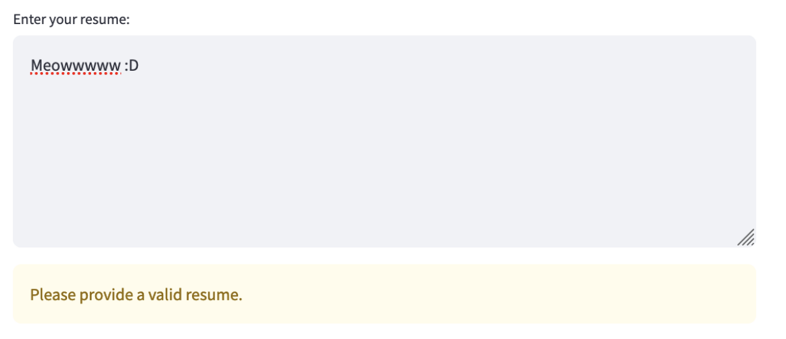
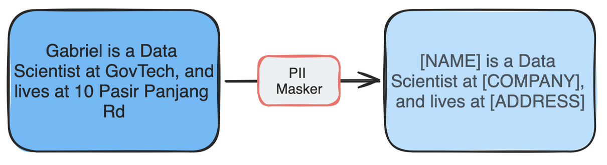

# Production Integration

!!! info "About this page"

    This page is new in the upcoming Responsible AI Playbook release. It covers integration checklist, common mistakes, and best practices for production guardrail deployment. Unhighlighted sections are migrated from the previously published [Best Practices When Integrating Guardrails](https://playbooks.aip.gov.sg/responsibleai/guardrails/best_practices/) page; new prose is highlighted.

Production integration is where mitigations become part of the application workflow.

## Integration Checklist

- Decide where each mitigation runs: input, retrieval, model output, tool call, log, or human review.
- Define actions for allow, warn, block, redact, and escalate outcomes.
- Set thresholds and document why they are appropriate.
- Measure latency and cost impact.
- Log enough for monitoring without retaining unnecessary sensitive data.
- Add regression tests for known failures.
- Define who reviews alerts and failures after launch.

## Common Mistakes

- Adding guardrails without testing their false positives.
- Treating provider safety filters as the only mitigation.
- Logging raw PII while trying to detect PII leakage.
- Applying the same threshold to every user journey.
- Not testing multi-turn and tool-use behavior.

## Best Practices for Integration

### 1. Start simple

Guardrails are needed from Day One, but you don't need complex solutions to get started. Even basic measures work:

- Structured inputs instead of free-form text.
- Simple keyword search and pattern matching.
- Basic input validation.

These foundational protections do not require a data scientist.

### 2. Balance user experience with protection

Guardrails must balance blocking harmful content against maintaining a positive user experience. Over-filtering and false positives frustrate users and erode trust.

- Use **progressive disclosure** — start with warnings before blocking.
- Provide clear feedback on why content was flagged.
- Offer suggestions on how to modify flagged content.
- Allow users to override certain low-risk flags with acknowledgement.
- Use context-specific thresholds (stricter for public-facing content).

For example, mild profanity can show a warning before blocking:

For RAG that retrieves a chunk containing PII, you may not want to stop the request — modify the output to remove the PII instead:

### 3. Layer multiple guardrails for the same risk

Stacking guardrails covers each one's weaknesses (the Swiss cheese model). Combine:

- Built-in LLM safety features and external moderation APIs.
- General and localised content moderation (e.g. OpenAI moderation + LionGuard).
- Pattern matching and ML-based detection.

### 4. Need speed? Go async

To minimize latency impact when using multiple guardrails:

- Process guardrail checks **asynchronously in parallel**.
- Run LLM generation alongside guardrail detection. See [OpenAI's cookbook](https://cookbook.openai.com/examples/how_to_use_guardrails#mitigations) for an implementation pattern.
- Use lightweight models where possible (e.g. PromptGuard at 86M parameters).
- Implement caching for frequently checked content.
