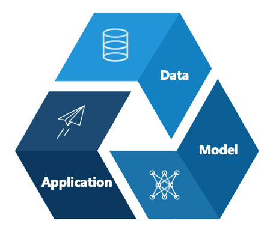

# Responsible AI

## What is Responsible AI?

Broadly, Responsible AI (“RAI”) focuses on how to **develop, evaluate, deploy, and monitor AI systems in a safe, trustworthy, and ethical manner**. From how data is collected to how humans interact with AI systems, RAI will help to guide these decisions toward beneficial and equitable outcomes. In the public sector context, RAI will help align AI systems to achieve the public good.

At GovTech's AI Practice, we break down RAI into 6 key principles that AI systems should strive towards. 

| Principle    | Description |
|--------------|-------------|
| Safety       | AI systems should be (i) protected against adversarial threats and misuse for harmful activities and (ii) aligned to the public good. |
| Robustness   | AI systems should perform up to task even when subjected to challenging requirements or circumstances. |
| Fairness     | AI systems should strive to be fair and equitable to all, regardless of gender, race, religion, or other attributes. |
| Explainability | AI systems should provide clear and reliable explanations for their automated decisions to key stakeholders. |
| Privacy      | AI systems should handle personal data carefully and protect against potential data leakages. |
| Transparency | AI systems should document key development and deployment choices and be clear about how the AI system should be used. |

## Why is RAI important?

/// caption
Examples of how LLM systems can fail in the real world
///

Responsible AI is crucial to prevent unintended consequences and biases in automated systems. For instance, a Chevrolet dealership implemented a ChatGPT-powered chatbot to assist customers. However, [users exploited the chatbot's lack of safeguards](https://venturebeat.com/ai/a-chevy-for-1-car-dealer-chatbots-show-perils-of-ai-for-customer-service/), prompting it to agree to absurd deals, such as selling a 2024 Chevy Tahoe for $1. Similarly, a [Bloomberg investigation](https://www.bloomberg.com/graphics/2024-openai-gpt-hiring-racial-discrimination/?leadSource=uverify%20wall) revealed that OpenAI's GPT-4 model exhibited racial biases when ranking resumes. The LLM favored names associated with Asian women and ranked those linked to Black men lowest for certain job roles. 

In another example, Air Canada's LLM chatbot provided a customer with incorrect information regarding bereavement fares, which led to the customer's claim being denied by Air Canada on the basis that the chatbot's information was non-binding. [A Canadian tribunal ruled against the airline](https://aibusiness.com/nlp/air-canada-held-responsible-for-chatbot-s-hallucinations-), emphasizing that companies are accountable for the information their AI systems disseminate, regardless of disclaimers. ​

These incidents highlight the need for AI application developers **to consider how their AI models could fail, test their models and applications rigorously, and implement measures to reduce the likelihood of such failures**. This is at the heart of what we do in the Responsible AI space.

## Where can issues arise?

/// caption
The AI life cycle consists of the data, model, and application.
///

Issues of safety, bias, robustness, and other RAI areas can exist at each stage of the application life cycle. Below we go through each stage and explain how some of these issues may emerge.

### Data

As the old adage goes, "garbage in, garbage out". **If unsafe or biased data is used for training, the model outputs are likely to be unsafe and biased as well.** For example, ​[a 2019 study](https://www.washingtonpost.com/health/2019/10/24/racial-bias-medical-algorithm-favors-white-patients-over-sicker-black-patients/) revealed that a widely used healthcare algorithm exhibited racial bias by underestimating the health needs of black patients compared to equally ill white patients. The algorithm used healthcare costs as a proxy for health needs, leading to black patients, who typically incur lower healthcare costs due to systemic disparities, being assigned lower risk scores. Consequently, black patients were less likely to be referred for advanced care management programs.

In the Generative AI space, LLMs are typically pre-trained on massive amounts of text or image data from the Internet, which contain harmful, toxic and biased texts. Since LLMs autoregressively generate the next most probable token, the output depends on the joint distribution of tokens learned during training. If unsafe token sequences are learned, they will naturally be reproduced by the model, as [ChatGPT did in its early days](https://www.bloomberg.com/news/newsletters/2022-12-08/chatgpt-open-ai-s-chatbot-is-spitting-out-biased-sexist-results). For image generation models, there have been [several studies](https://www.cigionline.org/articles/generative-ai-tools-are-perpetuating-harmful-gender-stereotypes/) finding that generated outputs of engineers, scientists, or lawyers disproportionately portray men over women, reflecting the unequal gender representation of those occupations in the training data.

### Model

In discriminative AI settings, the choice of modelling parameters can greatly impact their fairness. One key consideration is whether to include sensitive variables (i.e. variables about protected attributes like race or gender) in the model. On one hand, including these variables may result in bias against specific groups, such as [ageist and sexist bias in online recruitment software](https://www.reuters.com/legal/tutoring-firm-settles-us-agencys-first-bias-lawsuit-involving-ai-software-2023-08-10/). However, algorithmic bias has also been shown to persist even in models that deliberately exclude sensitive variables from the model, such as [with recidivism prediction (i.e. COMPAS)](https://www.propublica.org/article/machine-bias-risk-assessments-in-criminal-sentencing) or [with delivery services (i.e. Amazon Prime)](https://www.bloomberg.com/graphics/2016-amazon-same-day/).

In the generative AI space, significant research has been dedicated to aligning models with human preferences and desirable values. Given paired text data and their rankings, LLMs undergo a second stage of reinforcement learning to learn to output preferred (i.e., safer) responses. 

Another significant research direction entails analysing harmfulness and toxicity in LLM neurons and layers. Having found the weights or activations that are most responsible for toxicity, it is then possible to edit the models to reduce the incidence of harmful outputs. This is typically known as a white box approach to tackling model harmfulness. 

### Application

Finally, when an AI model is embedded into a software application, the way users interact with the application may also result in significant risks. For example, users may intentionally probe the application to exfiltrate sensitive data or elicit harmful outputs at scale. As such, input and output guardrails have emerged as viable defences against such risks. Guardrails are typically known as black-box defences as they do not require access to the models and can be easily deployed in the application layer. 

## Our Approach

_Figure: Functional focus areas for Responsible AI._

At present, our approach to deploying AI model safely involves **testing**, **mitigation** and model **understanding**. 

Testing involves establishing safety categories of interest, as well as their requisite metrics. This is followed by collecting testing data, which can be static or dynamic, general or domain/use case-specific, synthetic or real. The testing data is then used to generate safety metrics, to determine the overall safety of the application. While testing can technically be conducted at any point of the application life cycle, third party testing is typically done at the application level. 

After testing is completed, mitigation measures can then be adopted, where applicable and appropriate. A common mitigation measure is finetuning or alignment, in which AI models are trained to output human-preferred responses, or aligned to human values, requiring access to model weights. On the other hand, mitigations at the application level in the form of guardrails are more general and can be widely applied to different contexts. 

Lastly, model understanding, whether by understanding the internal mechanisms (i.e., mechanistic interpretability) or outputs (i.e., explainability), is important in increasing transparency of and trust in AI. 

In the first version of this playbook, we will focus on testing and mitigations at the application level. At present, this largely entails [output testing](testing.md) and [guardrails](guardrails.md).
