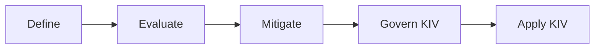

# AI Evaluation and Safety Lifecycle

!!! info "About this page"

    This page is new in the upcoming Responsible AI Playbook release. It walks through the Define → Evaluate → Mitigate → Deploy → Monitor lifecycle that the playbook is organised around. All content is new.

The playbook is organized around a practical lifecycle:

## Define

Clarify what the system is for before choosing tests or guardrails.

Define:

- Intended users and user journeys.
- Intended use and prohibited use.
- Application type and risk context.
- Functional success criteria.
- Safety categories that matter for the system.

Use [Understanding Risks](../understanding-risks/index.md) to turn this into a concrete risk scope.

## Evaluate

Measure whether the system works and where it fails.

Evaluation includes:

- [Accuracy and task-quality evals](../evaluating-ai-systems/functional.md)
- [RAG and grounding evals](../evaluating-ai-systems/functional.md)
- [Performance evals](../evaluating-ai-systems/functional.md)
- [Safety evals](../evaluating-ai-systems/safety.md)
- [Privacy and PII leakage evals](../evaluating-ai-systems/privacy.md)
- [Robustness evals](../evaluating-ai-systems/robustness.md)
- [Fairness evals](../evaluating-ai-systems/fairness.md)

## Mitigate

Reduce risk based on evaluation findings.

Mitigations include guardrails, UX design, retrieval constraints, access controls, prompt changes, tool permissioning, human escalation, logging, and rate limits. Start with [Mitigations & Controls](../mitigations-controls/index.md).

## Govern and Apply

Governance and use-case playbooks are KIV for now. The current playbook keeps the near-term focus on evaluation and safety implementation.
