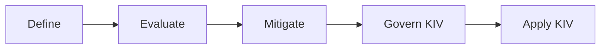

# AI Evaluation and Safety Lifecycle

The playbook is organized around a practical lifecycle:

## Define

Clarify what the system is for before choosing tests or guardrails.

Define:

- Intended users and user journeys.
- Intended use and prohibited use.
- Application type and risk context.
- Functional success criteria.
- Safety categories that matter for the system.

Use [Defining Risks](../defining-risks/index.md) to turn this into a concrete risk scope.

## Evaluate

Measure whether the system works and where it fails.

Evaluation includes:

- [Accuracy and task-quality evals](../evaluation-testing/accuracy-task-quality.md)
- [RAG and grounding evals](../evaluation-testing/rag-grounding.md)
- [Performance evals](../evaluation-testing/performance.md)
- [Safety evals](../evaluation-testing/safety-evals.md)
- [Privacy and PII leakage evals](../evaluation-testing/privacy-pii.md)
- [Robustness evals](../evaluation-testing/robustness.md)
- [Fairness evals](../evaluation-testing/fairness.md)

## Mitigate

Reduce risk based on evaluation findings.

Mitigations include guardrails, UX design, retrieval constraints, access controls, prompt changes, tool permissioning, human escalation, logging, and rate limits. Start with [Guardrails and Mitigations](../guardrails-mitigations/index.md).

## Govern and Apply

Governance and use-case playbooks are KIV for now. The current playbook keeps the near-term focus on evaluation and safety implementation.
