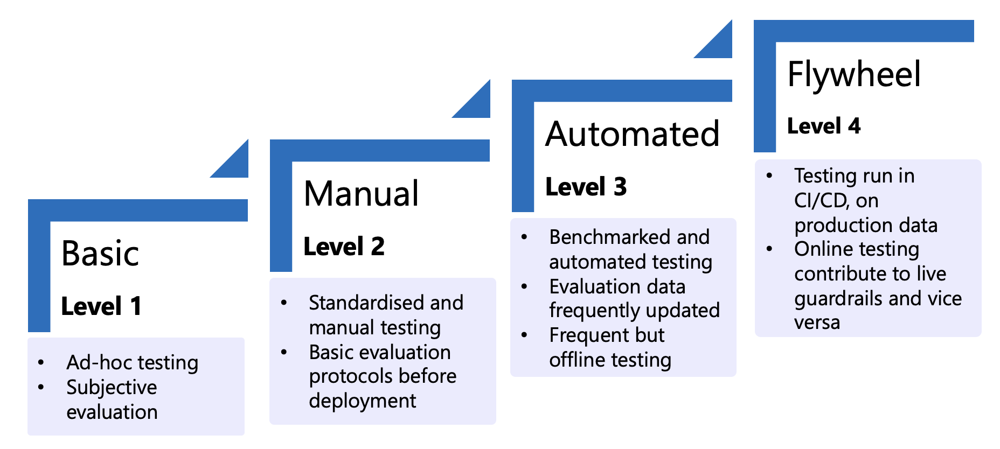
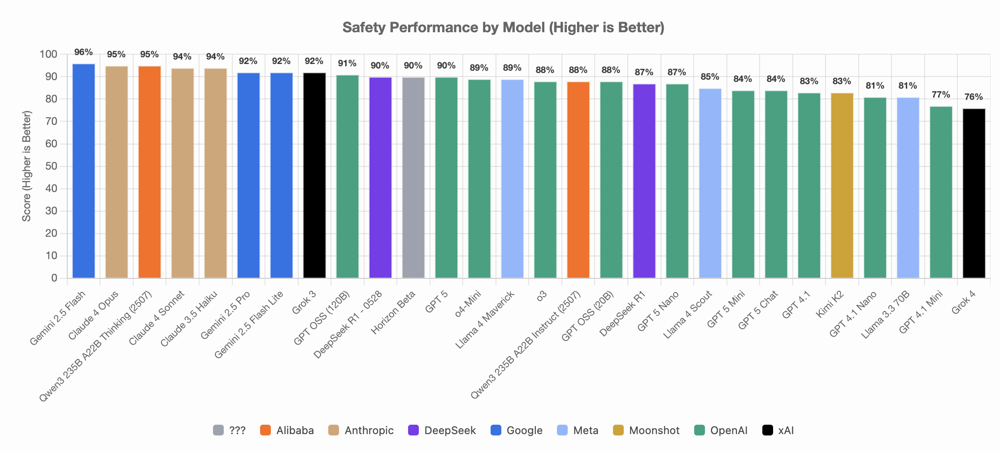

# Testing

!!! success "Key Message"

    Testing is the process of establishing risk categories of interest, creating benchmarks and establishing quantitative metrics, and measuring a system's performance against the benchmark. Testing should be (i) meaningful and representative, (ii) contextualised, and (iii) continuous.

## What is testing?
Testing (possibly also known as "evaluations") is the process of 

1. establishing risk categories of interest
2. creating and defining benchmarks
3. measuring a system's performance against this benchmark

in order to ensure that the system is accurate, reliable and robust.

_Figure: Stages of testing maturity in AI systems._

We can think of testing maturity in stages. Ideally, we want to be at level 4, where testing is comprehensive and automated. At level 4, testing is continuously performed, ensuring that risks are continuously monitored and mitigated as users interact with the application and data distributions shift. However, based on our knowledge, level 1-level 3 testing are most commonly adopted in the industry today. This is largely due to the difficulty in measuring how good/trusted/comprehensive the testing benchmark is. Nonetheless, as SOTA moves towards level 4, we believe that we can gradually level up Whole-of-Government (WOG) testing of AI systems. 

## Principles for Effective Testing 🎯

We have four guiding principles when collecting data for testing:

1. **Meaningful and representative**: Testing  needs to be meaningful by ensuring that data need to accurately and directly test the LLM for risk of concern. Testing needs to be representative and accurately reflect the real-world distribution of risks that users may encounter. For example, a human-facing application needs to be tested with data that is sufficiently realistic and naturalistic. 
2. **Diverse and varied**: Testing needs to be diverse in content, framing and sources to ensure comprehensiveness. They must cover a broad range of risks (i.e., content) and vary in linguistic structure, in order to reflect the real-world distribution.
2. **Contextualised and/or localised**: Testing needs to be localised to the context. If we're testing for toxicity in Singapore, this includes Singapore-specific references, vocabulary, and grammar. Curating long-tail, context-specific tests is valuable in assessing whether the model can detect underrepresented forms of localised risks.
3. **Incremental complexity**: The design of attack levels should align with the target users, starting with simple adversarial tests and gradually increasing in sophistication. Intermediate attacks combine basic level prompts with adversarial prompting templates like role-playing exploits and prompt injections to enhance difficulty. 

## Key testing dimensions

### Safety Testing 🦺

Safety testing is crucial for generative AI applications because their stochastic nature can produce unpredictable and potentially harmful outputs. Ensuring these systems operate within safe boundaries helps mitigate safety risks in WOG AI applications. 

See [safety testing](testing/safety_testing/safety_testing.md) for more details. 

### Fairness Testing ⚖️

While outputs are constrained and more predictable in discriminative AI applications, they can nonetheless disproportionately impact certain groups based on protected and sensitive attributes like race or gender. Hence, significant work has been done to establish fairness testing and metrics in discriminative AI. 

See [discriminative AI fairness testing](testing/fairness_testing/fairness_discriminative.md) for more details. 

Similarly, fairness testing is essential in generative AI to ensure that outputs do not perpetuate biases or discriminate against specific groups. This is especially due to the fact that LLMs have been trained on Internet data, which are known to contain biases. 

See [generative AI fairness testing](testing/fairness_testing/fairness_generative.md) for more details.

### Robustness Testing 💪

Robustness refers to a system’s ability to maintain reliable performance when faced with unexpected or challenging conditions, like noisy inputs, adversarial attacks, or shifts in the environment. It is important for AI applications to behave consistently well on unseen, perturbed, or out-of-distribution examples. Robustness is critical for any AI system deployed in high-stakes settings, especially in government services, where citizens depend on accurate, up-to-date information to make decisions with financial, legal, or medical consequences. 

See [robustness testing](testing/robustness_testing/robustness_testing.md) for details. 

### Agentic Testing 🤖

Agentic systems are often more prone to unsafe behaviors than their base models, partly due to their growing autonomy and expanded capabilities through tool integration. As agentic systems are able to define their own goals and plans and execute multi-step operations without humans in the loop, the impact and blast radius of failures in agentic systems are significantly larger. Instead of simply testing the outputs of the AI application, we need to test and evaluate the safety, security and robustness of each component in the agentic system. 

See [agentic testing](testing/agentic_testing/agentic_testing.md) for details. 

## Responsible AI Benchmark

We have developed the Responsible AI Benchmark, a collection of **application-level safety, robustness and fairness tests** designed around real-world use cases. The benchmark serves as a rough guide for developers in filtering down a subset of appropriate models for their use case. However, it is still necessary for application developers to conduct their own testing before deployment. 

/// caption
Screenshot of RAI Bench on Safety Performance, taken on 12 Aug 2025
///

Visit the [**Responsible AI Benchmark**](https://go.gov.sg/rai-bench) space for updated results and information.