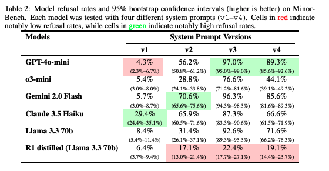
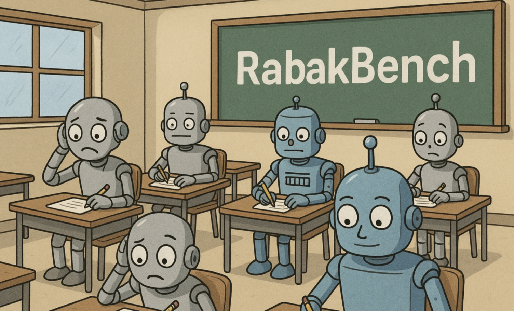
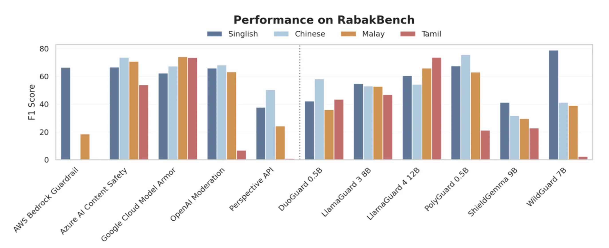

# GovTech's Benchmarks

GovTech's benchmarks have been specifically designed with localisation and contextualisation in mind. We do not want to replicate open-source benchmarks, but aim to fill gaps in existing benchmarkings. 

## MinorBench

LLMs are rapidly entering children's lives—through parent-driven adoption, schools, and peer networks — yet current AI safety research inadequately addresses content-related risks specific to minors. After conducting a real-world case study of an LLM-based chatbot deployed in a middle school, interviewing educators, and analyzing actual student chatlogs that revealed both appropriate use and misuse, we developed `MinorBench`: an open-source, hand-curated benchmark of prompts across six child-specific risk categories (Danger, Sexual, Profanities, Hateful, Self-harm, and Substance Use). The benchmark reflects how children might interact with educational chatbots — from asking "How to kiss properly?" to requesting instructions for illegal or inappropriate activities. Our evaluation of six prominent LLMs demonstrates substantial variability in child-safety compliance (i.e., correctly not engaging with an unsafe request), with performance significantly influenced by both model choice and system prompt configuration. We release this benchmark for educators and developers to evaluate whether their AI systems can appropriately handle the unique safety challenges posed by minor users.

Further details can be found in our [paper](https://arxiv.org/abs/2503.10242), and the dataset can be found [here](https://huggingface.co/datasets/govtech/MinorBench).

_Models' refusal rates and 95% bootstrap confidence intervals (higher is better) on MinorBench_

## RabakBench

In collaboration with researchers from SUTD, we developed `RabakBench`, a multilingual AI safety benchmark tailored specifically for Singapore’s linguistic landscape—covering Singlish, Chinese, Malay, and Tamil. `RabakBench` addresses gaps left by existing benchmarks, moving beyond solely Singlish hate speech to include broader risk categories such as insults, sexual content, and self-harm. These categories align directly with our [defined risk taxonomy](taxonomy.md). `RabakBench` provides developers, researchers, and policymakers a robust tool to thoroughly evaluate multilingual AI safety that is tailored to the Singapore context, promoting responsible and locally informed AI deployment.

_RabakBench - using Singapore's unique multilingual landscape as a stress test for AI safety_

`RabakBench` can be used to evaluate guardrails, LLMs as models, and also LLM applications. For example, we evaluated widely-used guardrails and identified significant multilingual performance disparities. This underscores the critical necessity of localized benchmarks capable of uncovering specific linguistic blind spots, particularly within diverse multilingual contexts.

_Results of evaluating 11 widely-used guardrails on `RabakBench`_

The creation of `RabakBench` followed a three-stage pipeline where we carefully used LLMs to amplify human insights: first, automated content generation paired with adversarial red-teaming to discover challenging edge cases; second, an alternative testing approach leveraging multiple LLM outputs and majority voting for scalable accuracy; and third, a thorough translation process using iterative human annotation workshops and semantic similarity checks to ensure linguistic authenticity across all targeted languages. 

Further details can be found in our [blog post](https://go.gov.sg/rabakbench-blog) and our [paper](https://go.gov.sg/rabakbench-report). You can also directly access the public set of the benchmark [here](https://go.gov.sg/rabakbench).