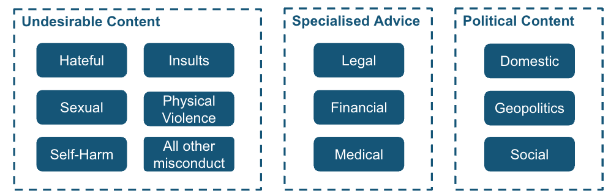

# Risk Taxonomy

!!! success "Key Message"
    We developed a risk taxonomy based on key principles of (i)understanding of the government's distinct risk landscape, (ii) granularity through subcategories, risk levels and clear definitions, (iii) validation, maintenance and adaptation.

## Why is a taxonomy necessary? 

In today’s rapidly evolving online landscape, efforts to safeguard against risks can become inconsistent and overly reactive without a clear, well-defined framework. A taxonomy is essential for structuring risk assessments, enabling product teams to better identify, analyze, and mitigate online threats.

Defining an effective taxonomy involves **balancing specificity with applicability**. Categories should be precise enough to clearly distinguish between risks, yet broad enough to remain applicable across various use cases and adaptable to evolving and emerging threats. Ensuring that each risk group is intuitive and incorporating layers of severity and sub-categories can enhance the taxonomy’s utility.

## Why a taxonomy for WOG specifically? 

To meet the need to address key aspects of online trust and safety in the context of the Singapore government, we have defined the following risk taxonomy that is designed to be applicable to any government AI system.  

_Figure: Risk Taxonomy for WOG AI systems_

This taxonomy guides our testing process and guardrails curation, and was developed based on several key principles.  

### 1. Understanding of the government's distinct risk landscape 

Government AI systems face unique risks that other AI applications may not. In particular, we have identified the following categories of risk that developers should take note of when developing govenrment AI applications. 

1. **Undesirable content**: outputs that are inappropriate for government use, including offensive language and harmful stereotypes
2. **Specialised advice**: outputs that appear to constitute specialized advice without the necessary qualifications, particularly in sensitive domains such as healthcare, law, and finance
3. **Political content**: output that can appear as political bias and result in misinterpretation and reputational harm.

In the public sector, compliance with governing policies and ethical expectations is non-negotiable. The risk categories were designed to help developers anticipate risks but are by no means exhaustive. Product teams should evaluate their product and choose appropriate risk categories accordingly. 

### 2. Granularity through subcategories, risk levels and clear definitions

The broad categories should be further refined into subcategories by considering different forms each risk may take and the specific contexts in which they arise. Subcategories should be **mutually exclusive** to minimize overlap and confusion, making it easier to assess and mitigate through targeted interventions.

Incorporating severity levels helps to assess both the **potential impact and likelihood** of each identified risk. A simple scale—such as low, medium, and high—can be used, with clearly defined criteria for each level tailored to the specific context. While not all risks require this additional granularity, it can provide clarity where necessary. 

Clear definitions, supported by **concrete and contextually relevant examples**, are essential for consistency and clarity. Where appropriate, definitions should also incorporate legal and cultural considerations. 

!!! tip "Example: Definition of Hate in our taxonomy"

    **Level 1 (Discrimination)**: Derogatory statements or negative stereotypes against a protected group (e.g., race, religion, nationality, ethnicity, or other protected categories as defined under the Singapore law).

    *Example*: “If you notice in uni got no malays one, they all at scdf. I not racist, this is a fact.”

    **Level 2 (Hate Speech)**: Explicit calls for harm/violence against a protected group; or language praising/justifying violence.

    *Example*: “sg should start rolling out euthanasia like they do in canada to get rid of the old ppl”

### 3. Validation, maintenance and adaptation

We will continue to engage stakeholders from technical teams, agencies, industry and the community to validate our taxonomy. Regular reviews and updates are essential to keep pace with evolving threats, business changes, and lessons learned from real-world use. Taxonomy curation is not a one-time task but an ongoing process. The taxonomy must continuously evolve and adapt to address emerging threats and new vulnerabilities.