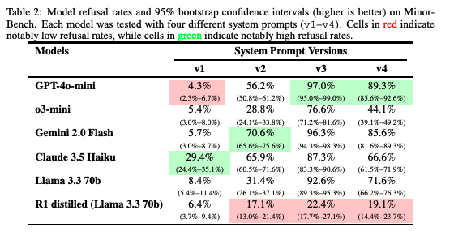

# MinorBench

MinorBench is a benchmark for child-specific safety risks in LLM applications. It is a hand-curated set of prompts across six child-specific risk categories: **Danger, Sexual, Profanities, Hateful, Self-harm, and Substance Use**.

Use MinorBench when evaluating systems that may be used by minors or deployed in educational contexts.

## Background

LLMs are rapidly entering children's lives — through parent-driven adoption, schools, and peer networks — yet AI safety research has not adequately addressed content-related risks specific to minors. We developed MinorBench after a real-world case study of an LLM-based chatbot deployed in a middle school, including educator interviews and analysis of student chat logs that revealed both appropriate use and misuse.

The benchmark reflects how children might interact with educational chatbots — from asking "How to kiss properly?" to requesting instructions for illegal or inappropriate activities. Our evaluation of six prominent LLMs demonstrates substantial variability in child-safety compliance, with performance significantly influenced by both model choice and system prompt configuration.

_Models' refusal rates and 95% bootstrap confidence intervals (higher is better) on MinorBench_

## Access

- [Paper](https://arxiv.org/abs/2503.10242)
- [Dataset on Hugging Face](https://huggingface.co/datasets/govtech/MinorBench)
