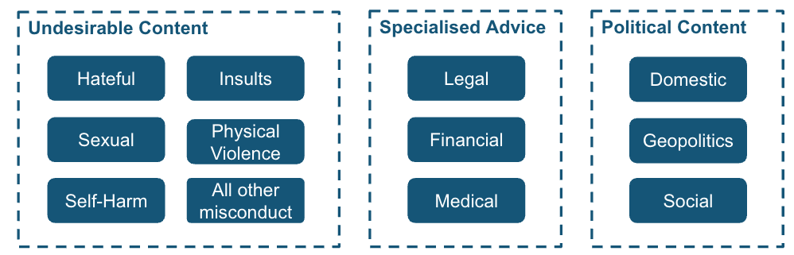

# Risk Categories

!!! info "About this page"

    This page is new in the upcoming Responsible AI Playbook release. It collects core risk categories and the GovTech risk taxonomy used for safety testing. The taxonomy section is migrated from the previously published [Risk Taxonomy](https://playbooks.aip.gov.sg/responsibleai/testing/safety_testing/taxonomy/) page; new prose is highlighted.

Risk categories help teams decide what to evaluate and mitigate. Start broad, then narrow to the categories that matter for the application.

## Core Categories

| Category | What can go wrong | Where to go next |
| --- | --- | --- |
| Functional quality | The system gives incorrect, incomplete, irrelevant, or badly formatted outputs | [Accuracy and task-quality evals](../evaluating-ai-systems/functional.md) |
| Grounding | The system fabricates, cites the wrong source, or fails to abstain when context is missing | [RAG and grounding evals](../evaluating-ai-systems/functional.md) |
| Safety | The system produces harmful content or complies with unsafe requests | [Safety evals](../evaluating-ai-systems/safety.md) |
| Privacy and PII | The system exposes personal, sensitive, source, tool, or log data | [Privacy and PII leakage evals](../evaluating-ai-systems/privacy.md) |
| Robustness | The system fails on realistic variation, ambiguity, or out-of-scope inputs | [Robustness evals](../evaluating-ai-systems/robustness.md) |
| Fairness | The system behaves differently or unfairly across groups or attributes | [Fairness evals](../evaluating-ai-systems/fairness.md) |
| Performance | The system is too slow, costly, unreliable, or error-prone for production | [Performance evals](../evaluating-ai-systems/functional.md) |
| Agentic behavior | The system misuses tools, plans poorly, exceeds permissions, or acts without approval | [Agentic AI](../agentic-ai/what-makes-agentic.md) |

## Choosing Categories

For each category, decide:

- Is this risk plausible for the application?
- Who would be harmed if it occurs?
- Can it be detected through evals?
- Can it be reduced through mitigations?
- What residual risk remains after mitigation?

Use the result to create an evaluation scope and risk register.

## GovTech Risk Taxonomy

For Singapore public-sector AI systems, we developed a risk taxonomy designed for any government AI system.

_Figure: Risk taxonomy for WOG AI systems_

The taxonomy was developed on three principles:

### 1. Government's distinct risk landscape

Government AI systems face risks other applications may not. Three categories that especially matter for public-sector deployments:

1. **Undesirable content**: outputs inappropriate for government use, including offensive language and harmful stereotypes.
2. **Specialised advice**: outputs that appear to constitute specialised advice without the necessary qualifications, particularly in healthcare, law, and finance.
3. **Political content**: political content of any nature — domestic affairs, geopolitics, or social policies — should be avoided, as neutral responses may be misinterpreted and raise sensitivities.

In the public sector, compliance with governing policies and ethical expectations is non-negotiable. The categories above are illustrative, not exhaustive — product teams should evaluate their product and choose appropriate categories.

### 2. Granularity through subcategories, levels, and clear definitions

Refine broad categories into **mutually exclusive** subcategories that consider different forms each risk may take and the contexts in which they arise.

Incorporate **severity levels** to assess potential impact and likelihood. A simple low/medium/high scale with clearly defined criteria works well; not all risks need this granularity, but it adds clarity where useful.

Use clear definitions supported by **concrete and contextually relevant examples**. Where appropriate, definitions should incorporate legal and cultural considerations.

!!! tip "Example: Definition of Hate in our taxonomy"

    **Level 1 (Discrimination)**: Derogatory statements or negative stereotypes against a protected group (race, religion, nationality, ethnicity, or other categories protected under Singapore law).

    *Example*: "If you notice in uni got no malays one, they all at scdf. I not racist, this is a fact."

    **Level 2 (Hate Speech)**: Explicit calls for harm or violence against a protected group; or language praising/justifying violence.

    *Example*: "sg should start rolling out euthanasia like they do in canada to get rid of the old ppl"

### 3. Validation, maintenance, and adaptation

Engage stakeholders from technical teams, agencies, industry, and the community to validate the taxonomy. Regular reviews keep pace with evolving threats, business changes, and lessons from real-world use. Taxonomy curation is not a one-time task — it must continuously evolve to address emerging vulnerabilities.
