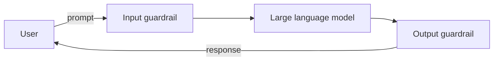

# Improving AI systems

Improvements take three broad forms.

<strong>Guardrails</strong>
Separate components that filter, adjust, or block content around the model.
<a href="guardrail-architecture/">Guardrail architecture</a>

<strong>Finetuning</strong>
Changing model weights to shape the behaviour of the model itself.
<a href="finetuning/">Finetuning</a>

<strong>Principle-specific</strong>
Controls organised around the Responsible AI principles — functional, safety, robustness, fairness, and privacy.
<a href="safety-improvements/">Improving RAI principles</a>

AI safety work may also require UX changes, retrieval constraints, access controls, prompt design, tool permissioning, human review, logging, rate limits, and operational controls.

:::tip[Key message]

Choose mitigations based on evaluated failure modes. Do not add guardrails just because they are available.

:::

## What are guardrails?

Guardrails are protective mechanisms that increase the likelihood of an LLM application behaving appropriately and as intended. We use the term to refer specifically to *separate components* from the LLM itself — components that filter or adjust harmful or undesired content before it is generated by the LLM or returned to the user.

_Figure: High-level overview of guardrails in an AI system. See [guardrail architecture](guardrail-architecture.md) for the fuller picture, including retrieval and human escalation._

Prompts first pass through an **input guardrail** before being sent to the LLM. The output from the LLM passes through an **output guardrail** before being returned to the user. While LLMs may have built-in safety from training and API providers may apply their own guardrails on prompts, application-layer guardrails build on top of these for both performance and flexibility.

Guardrails can be as simple as a keyword check, but modern implementations typically incorporate machine learning to capture semantics and are multi-layered for robustness.

:::tip[Guardrails as a classification task]

For an ML mindset, guardrails can be thought of as binary classification: is the content acceptable or not? Standard classification metrics — precision, recall, ROC-AUC, F1 — apply.

:::

## Common mitigation types

| Mitigation | Use when |
| --- | --- |
| Input guardrails | Risky requests should be blocked, warned, rewritten, or escalated before model execution |
| Output guardrails | Generated responses may contain unsafe, private, irrelevant, or unsupported content |
| Retrieval constraints | Retrieved context may be irrelevant, stale, sensitive, or unauthorised |
| Tool-use controls | A system can take actions or access systems beyond text generation |
| UX and policy design | Users need clearer expectations, warnings, consent, or escalation paths |
| Human review | Errors are high-impact or hard to classify automatically |
| Monitoring and logging | Risks must be detected after launch and fed back into evals |

## Common risk types

| Type | Description | Input | Output |
|------|-------------|:-----:|:------:|
| [Toxicity / content moderation](safety-improvements.mdx#content-safety) | Harmful, offensive, or inappropriate content | ✓ | ✓ |
| [Jailbreak / prompt injection](safety-improvements.mdx#prompt-injection-and-jailbreaks) | Attempts to bypass system constraints or inject malicious prompts | ✓ | |
| [PII](privacy-improvements.mdx#pii-protection) | Information that can identify an individual | ✓ | ✓ |
| [Off-topic](robustness-improvements.mdx) | Content irrelevant to the application's purpose | ✓ | ✓ |
| [System-prompt leakage](privacy-improvements.mdx#system-prompt-leakage) | Exposure of system prompts containing application information | | ✓ |
| Hallucination | Content not factual or grounded in source material | | ✓ |

## Principles for effective guardrails

### 1. Performant, localised, and fast

Performance involves an inherent trade-off between false positives and false negatives — the precision-vs-recall trade-off. If the guardrail is too strict, harmless content gets flagged; too lenient, harmful content slips through.

Performance improves with a **multi-layered approach**. Each guardrail is like a slice of Swiss cheese; the holes represent weaknesses. Stacking guardrails covers each other's gaps.

<svg class="swiss-cheese" viewBox="0 0 680 260" role="img" aria-labelledby="cheese-title cheese-desc" xmlns="http://www.w3.org/2000/svg">
<title id="cheese-title">The Swiss cheese model of layered guardrails</title>
<desc id="cheese-desc">Three guardrail layers drawn as slabs with holes in them. Two hazards are stopped, one at the first layer and one at the second. A third hazard finds a gap in all three layers and reaches the user.</desc>
<mask id="cheese-holes" maskUnits="userSpaceOnUse" x="0" y="0" width="680" height="260">
<rect width="680" height="260" fill="#fff"/>
<g transform="matrix(1 -0.42 0 1 0 0)">
<ellipse cx="197.5" cy="202.95" rx="15" ry="20" fill="#000"/>
<ellipse cx="197.5" cy="250.95" rx="15" ry="20" fill="#000"/>
<ellipse cx="387.5" cy="282.75" rx="15" ry="20" fill="#000"/>
<ellipse cx="387.5" cy="234.75" rx="15" ry="20" fill="#000"/>
<ellipse cx="577.5" cy="362.55" rx="15" ry="20" fill="#000"/>
<ellipse cx="577.5" cy="417.55" rx="15" ry="20" fill="#000"/>
</g>
</mask>
<g class="swiss-cheese__hazard">
<path d="M30 72H150"/>
<path d="M30 168H340"/>
<path d="M30 120H648"/>
</g>
<g mask="url(#cheese-holes)">
<g transform="matrix(1 -0.42 0 1 0 0)">
<rect class="swiss-cheese__slab" x="150" y="118.0" width="95" height="175" rx="5"/>
<rect class="swiss-cheese__slab" x="340" y="197.8" width="95" height="175" rx="5"/>
<rect class="swiss-cheese__slab" x="530" y="277.6" width="95" height="175" rx="5"/>
</g>
</g>
<g class="swiss-cheese__hole" transform="matrix(1 -0.42 0 1 0 0)">
<ellipse cx="197.5" cy="202.95" rx="15" ry="20"/>
<ellipse cx="197.5" cy="250.95" rx="15" ry="20"/>
<ellipse cx="387.5" cy="282.75" rx="15" ry="20"/>
<ellipse cx="387.5" cy="234.75" rx="15" ry="20"/>
<ellipse cx="577.5" cy="362.55" rx="15" ry="20"/>
<ellipse cx="577.5" cy="417.55" rx="15" ry="20"/>
</g>
<g class="swiss-cheese__stopped">
<circle cx="150" cy="72" r="6"/>
<circle cx="340" cy="168" r="6"/>
<path d="M646 110 668 120 646 130Z"/>
</g>
</svg>

_Figure: The Swiss cheese model of guardrails. Each layer has gaps; stacking them means one layer covers another's weaknesses, and only a hazard that finds a gap in every layer gets through._

:::tip[Balancing precision and recall]

If your system can accommodate multiple guardrails, prioritise **precision per guardrail** and let **stacking** raise overall recall.

:::

Performance also requires **localisation**. A content moderation guardrail trained on the open internet may not classify Singapore-specific terms accurately. Beyond language and culture, business-context localisation matters too — terminology specific to one industry may not apply to another.

The final trade-off is between accuracy and **latency**. Guardrails should run efficiently to keep the user experience smooth.

:::note[Case study: LionGuard 🦁]

LionGuard is a content moderation guardrail localised to the Singapore context. See the [LionGuard tool page](../tools/lionguard.md) for details.

:::

### 2. Model-agnostic design

Guardrails are *separate components* from the LLM itself. This lets the team develop and test components independently, and swap LLMs or guardrails depending on the scenario.

A separate guardrail also lets you **set a minimum safety performance for the system**. Typical guardrails are more deterministic than LLM outputs. If a guardrail has 95% accuracy in detecting NSFW language, the system's safety floor is at least 95%, leaving the model to handle the remainder.

### 3. Actionable and configurable

Guardrails should expose **confidence or severity scores** rather than only binary decisions. With a 0–1 score, the application can take differentiated actions — log low-confidence detections, warn on medium, block on high.

:::info[Confidence and severity scores]

*Confidence* refers to how certain the guardrail is about its classification. *Severity* refers to the degree of harmfulness. Most guardrail providers expose one of the two. For confidence, calibration matters: a well-calibrated 0.5 score means the content really is harmful 50% of the time. Out-of-the-box ML models are usually not well-calibrated — see [scikit-learn's calibration docs](https://scikit-learn.org/1.5/modules/calibration.html).

:::

Configurability matters too. Teams should be able to adjust thresholds and action bands based on the application's context — prioritise recall in healthcare where safety is paramount, or precision in customer service where false positives erode trust.

:::note[Original blog post]

This page is adapted from our [original blog post](https://medium.com/dsaid-govtech/building-responsible-ai-why-guardrails-matter-b66e1d635d71) on guardrails.

:::
