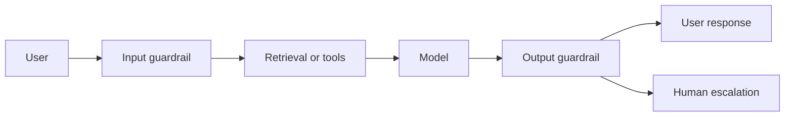

# Guardrail Architecture

:::info[About this page]

This page is new in the upcoming Responsible AI Playbook release. It explains where guardrail checks sit in an application, what each layer detects, and what action to take. All content is new.

:::

A guardrail architecture defines where checks happen, what they detect, and what action the application takes.

## Common Positions

- **Input guardrails** inspect user input before it reaches the model.
- **Output guardrails** inspect model responses before they reach the user.
- **Retrieval-time guardrails** filter or constrain retrieved documents and snippets.
- **Tool-use guardrails** constrain which tools can be called and with what arguments.
- **Human escalation** routes uncertain or high-impact cases to a reviewer.

## Design Questions

- What risk is this guardrail meant to reduce?
- Is it applied to input, output, retrieval, tools, or logs?
- What happens on low, medium, and high confidence detections?
- How will false positives and false negatives be measured?
- Can the guardrail be bypassed through multi-turn behavior or tool use?
