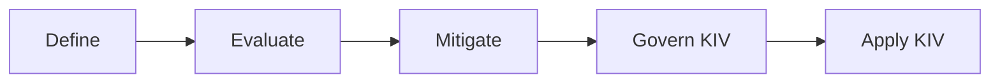

# Getting started

Welcome to the Responsible AI Playbook! This playbook is developed by GovTech Singapore's AI Practice, and aims to help you **build safe and trustworthy AI systems** by **providing practical guidance and useful insights**. 

We designed this playbook to cater to three main archetypes within the Singapore public sector:

* [Application developers who build AI systems](#application-developers)
* [Governance officers who oversee AI systems](#governance-teams)
* [AI practitioners who want to learn more about Responsible AI](#ai-practitioners)

## Application developers

You build and launch AI products and want to ship safely without becoming a Responsible AI specialist. 

What this playbook gives you:

- A [simple and effective approach to developing an evaluation plan](../evaluating-ai-systems/index.md) you can run before launch.
- Open-source guardrails, like [LionGuard 2](../tools/lionguard.md), and benchmarks, like [MinorBench](../tools/minorbench.md) you can drop into your stack.
- Concrete guides for [PII redaction](../improving-ai-systems/privacy-improvements.mdx#pii-protection), [content safety](../improving-ai-systems/safety-improvements.mdx#content-safety), [prompt-injection defence](../improving-ai-systems/safety-improvements.mdx#prompt-injection-and-jailbreaks).

## Governance teams

You oversee AI risk across an organisation — setting policy, reviewing launches, and tracking residual risk.

What this playbook gives you:

- [A shared evaluation framework](../evaluating-ai-systems/index.md) across safety, robustness, fairness, privacy, and agentic dimensions.
- [Clear understanding of Responsible AI](./about-responsible-ai.md) and the 6 different principles
- Concrete [improvement patterns](../improving-ai-systems/index.md) — guardrails, finetuning, and principle-specific controls — to require of product teams.
- The full [Glossary](../tools/glossary.md) of terms used across the playbook.

## AI practitioners

You are an AI practitioner — a data scientist or ML engineer building AI models, evaluations, or systems — and want practical Responsible AI patterns you can apply alongside your existing work.

What this playbook gives you:

- Deep technical guidance on [evaluation methods](../evaluating-ai-systems/methods.mdx), [threshold tuning](../improving-ai-systems/threshold-tuning.md), and [building your own guardrail](../improving-ai-systems/building-your-own-guardrail.md).
- Benchmarks we maintain — [RabakBench](../tools/rabakbench.md), [MinorBench](../tools/minorbench.md), the [Responsible AI Benchmark](../tools/responsible-ai-benchmark.md) — and the [Litmus](../tools/litmus.md) test harness.
- A curated reading list of papers, surveys, and external tools in [External resources](../resources.md).

## The lifecycle

The playbook is organised around a practical lifecycle:

