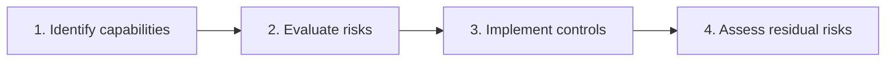

# Agentic Risk & Capability Framework

The [Agentic Risk and Capability Framework](https://govtech-responsibleai.github.io/agentic-risk-capability-framework/) (ARC) is GovTech's technical governance framework for identifying, assessing, and mitigating safety and security risks in agentic AI systems. It gives you three things: a taxonomy of what agentic systems can do, a register of 46 risks tied to those capabilities, and 88 technical controls tied to those risks.

ARC organises risk around capability rather than purpose, because the risks your system carries follow from what it can do rather than from what it was built for. A system that answers questions about leave policy and a system that also files the leave application share a purpose but differ substantially in risk, since only the second one takes actions with consequences outside the conversation.

## When to use it

Use ARC once you have established that your system is agentic and need to scope what to test and what to build. It tells you which risks are relevant and which controls address them. It does not tell you whether the system should be built at all, and it does not measure whether your controls work once implemented. That is the job of [evaluation](../evaluating-ai-systems/index.md).

ARC treats a system as agentic when it can plan and execute actions through tools rather than only generate text. That distinction matters because it moves the consequences of a failure out of the text and into the world. If your system only produces text for a person to read, it sits outside ARC's scope.

## How ARC describes a system

ARC splits an agentic system into three [elements](https://govtech-responsibleai.github.io/agentic-risk-capability-framework/arc_framework/elements/):

- **Components**: the model, its instructions, its tools, and its memory.
- **Design**: how your agents are arranged, what permissions they hold, and what the system logs.
- **Capabilities**: what your system can do in the world.

Components and design carry **baseline risks** that apply to every agentic system whatever it does. Your model may be insufficiently aligned, permissions may be broader than the task requires, and monitoring may be absent. These arrive with the architecture rather than with any particular feature.

Capabilities carry the risks specific to your system. ARC groups them into three categories.

<strong>Cognitive</strong>
How the system reasons and organises work: planning and goal management, agent delegation, and tool use.

<strong>Interaction</strong>
How the system engages the world outside itself: multimodal understanding and generation, official communication, business transactions, internet and search access, computer use, and other programmatic interfaces.

<strong>Operational</strong>
What the system changes on infrastructure: code execution, file and data management, and system management.

Identify which capabilities your system has, and the register returns the risks attached to each. The [full taxonomy](https://govtech-responsibleai.github.io/agentic-risk-capability-framework/arc_framework/elements/#capabilities) defines each capability precisely, and is the reference to use when the boundary between two of them is unclear.

## How risks are classified

Every risk in the register is described along three dimensions, which is what lets you filter it rather than read it as a flat list.

| Dimension | Values |
| --- | --- |
| [Element](https://govtech-responsibleai.github.io/agentic-risk-capability-framework/arc_framework/elements/) | The component, design element, or capability the risk arises from |
| [Failure mode](https://govtech-responsibleai.github.io/agentic-risk-capability-framework/arc_framework/risks/#failure-modes) | Agent failure, external manipulation, or tool and resource malfunction |
| [Hazard](https://govtech-responsibleai.github.io/agentic-risk-capability-framework/arc_framework/risks/#hazards) | Security (data, application, infrastructure and network, identity and access management) or safety (illegal and CBRNE activity, discriminatory or hateful content, inappropriate content, compromised user safety, misrepresentation) |

The three failure modes describe how a system goes wrong rather than what goes wrong as a result: (1) **agent failure**, where the agent does not operate as intended through poor performance, misalignment, or unreliability, (2) **external manipulation**, where a malicious actor deliberately causes the agent to deviate from intended behaviour, and (3) **tool or resource malfunction**, where the tools and resources your system depends on fail, are compromised, or prove inadequate.

## Applying ARC to a system

The [developer guide](https://govtech-responsibleai.github.io/agentic-risk-capability-framework/implementation/for-ai-developers/) sets out four steps.

1. **Identify capabilities.** Map each autonomous function of your system onto the taxonomy. Sending emails to members of the public maps to official communication, and running generated scripts maps to code execution. Where a function sits ambiguously between two capabilities, include both.
2. **Evaluate risks.** Pull the risks attached to each capability you identified, then add the baseline risks that come from components and design. Score impact and likelihood separately on a five-point scale, and keep the risks that meet your organisation's threshold.
3. **Implement controls.** Take the controls the register maps to each risk you kept, and adapt them to your implementation, subject to the control levels below.
4. **Assess residual risks.** For each control, establish what it does not prevent, then record whether the remaining exposure is accepted, monitored, or further mitigated.

ARC runs these four steps end to end against three systems in its [application examples](https://govtech-responsibleai.github.io/agentic-risk-capability-framework/implementation/for-ai-developers/#application-examples): a fact checker, a coding assistant, and a call assistant. Each walks from capabilities through to accepted residual risks, and they are the fastest way to see how your scoring thresholds change what you end up carrying.

## Control levels

Controls are graded by how much latitude you have in applying them.

| Level | Name | Expectation |
| --- | --- | --- |
| 0 | Cardinal | A fundamental requirement that cannot be waived. Adopted as written rather than adapted. |
| 1 | Standard | Adopted or adapted meaningfully and sensibly to the implementation. |
| 2 | Best practice | Worth considering, particularly for higher-risk systems. |

Each control works either by reducing the impact of a failure or by reducing the likelihood of it occurring, and the [controls documentation](https://govtech-responsibleai.github.io/agentic-risk-capability-framework/arc_framework/controls/) states which of the two a given control is doing. A single risk usually draws controls from more than one level. The risk of prompt injection through retrieved web content, for instance, carries two Level 0 controls alongside a Level 1 one.

## Common pitfalls

- **Skipping the baseline risks.** Component and design risks feel generic because they apply to everything, which makes them easy to pass over. They are also the risks least likely to have a clear owner.
- **Scoping capabilities too narrowly.** A capability your system holds but rarely exercises still carries its risks. Include a function where it sits ambiguously between two capabilities.
- **Treating Level 0 controls as adaptable.** Level 1 and 2 controls invite judgement, and Level 0 controls do not. If you reclassify one because it is inconvenient rather than inapplicable, the assessment stops being meaningful.
- **Stopping at implementation.** Having a control in place is not the same as having closed the risk. Every control leaves something uncovered, which is why step 4 asks you to name it and decide what to do about it.
- **Treating the assessment as complete evidence.** ARC establishes which risks apply and which controls address them. Whether those controls hold under adversarial conditions is a question for [evaluation](../evaluating-ai-systems/index.md).

## Access

  <a class="access-card access-card--docs" href="https://govtech-responsibleai.github.io/agentic-risk-capability-framework/arc_framework/introduction/"><strong>Framework documentation</strong>Rationale, elements, risks, and controls</a>
  <a class="access-card access-card--dataset" href="https://govtech-responsibleai.github.io/agentic-risk-capability-framework/arc_framework/risk-register/"><strong>Interactive risk register</strong>All 46 risks and 88 controls, filterable</a>
  <a class="access-card access-card--repo" href="https://github.com/govtech-responsibleai/agentic-risk-capability-framework"><strong>Repository</strong>Open-source repository and YAML sources</a>

[ARCvisor](https://govtech-responsibleai.github.io/agentic-risk-capability-framework/resources/#arcvisor) sits alongside the framework. It is an assistant that proposes relevant risks and controls from a description of your system, if you want a starting point before working through the register manually.

If you are adopting ARC across an organisation rather than assessing a single system, start with the [organisational adoption guide](https://govtech-responsibleai.github.io/agentic-risk-capability-framework/implementation/for-governance-teams/), which covers contextualising the taxonomy, setting scoring thresholds, and piloting before a wider rollout.

## Where to go next

- [Evaluating AI systems](../evaluating-ai-systems/index.md) — measuring whether the controls hold.
- [Improving AI systems](../improving-ai-systems/index.md) — implementing the controls.
