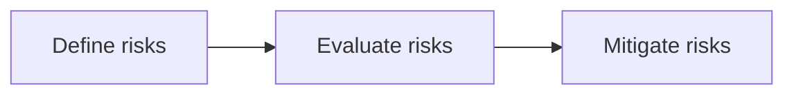

# Understanding Risks

:::info[About this page]

This page is new in the upcoming Responsible AI Playbook release. It is the entry point to the Understanding Risks section, covering intended/prohibited use, application risk profile, risk categories, and launch criteria. All content is new.

:::

Before choosing evals or guardrails, define what risks matter for the application. This section helps teams turn a broad Responsible AI concern into a concrete evaluation and mitigation scope.

:::tip[Key message]

Good risk definition answers four questions: what is the system for, what must it not do, who could be affected, and what evidence is needed before launch?

:::

## What to Define

A useful risk definition should cover:

1. **Intended use**: what the system is meant to help users do.
2. **Prohibited use**: what the system should refuse, block, avoid, or escalate.
3. **Application risk profile**: who uses the system, what data it handles, and what impact failures may have.
4. **Risk categories**: which functional, safety, privacy, robustness, fairness, and agentic risks are in scope.
5. **Launch criteria**: what minimum evaluation and mitigation evidence is required before release.

## Where This Fits

Start here if your team is still deciding what to test or what controls are needed.

## What Makes a System Agentic?

An AI system becomes agentic when it can pursue goals through multi-step behavior, make plans, use tools, maintain state, delegate tasks, or act with some degree of autonomy.

### Signs of Agentic Behavior

A system may be agentic if it can:

- Break a task into steps.
- Choose between tools or actions.
- Read from or write to external systems.
- Maintain memory or state across turns.
- Recover from failed steps.
- Act before every step is explicitly approved by a human.

### Why This Matters

Agentic systems change the risk model. You are no longer only evaluating generated text; you are evaluating planning, tool use, permissions, memory, state, monitoring, and operational consequences.

If your system has these properties, continue with the [agentic risk model](agentic-risk-model.md) and [agentic risk categories](agentic-risk-categories.md).

## Recommended Path

1. [Intended and prohibited use](intended-prohibited-use.md)
2. [Application risk profile](application-risk-profile.md)
3. [Risk categories](risk-categories.md)
4. [Launch criteria and risk register](launch-criteria-risk-register.md)

Then move to [Evaluating AI Systems](../evaluating-ai-systems/index.md) and [Mitigations & Controls](../mitigations-controls/index.md).
